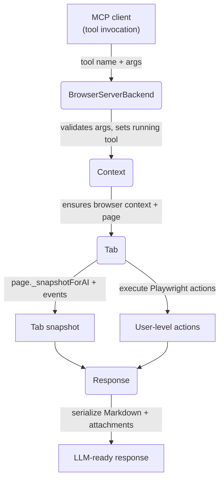

# Playwright MCP Browser Data Flow

## High-level topology
- **MCP server entrypoint**: `createConnection` wires the server name, version, and backend implementation; Playwright acts as the backend that exposes browser tools to the MCP runtime.
- **Backend stack**:
  1. `BrowserServerBackend` holds the filtered tool list and bridges MCP calls into a browser-aware `Context`.
  2. `Context` manages the lifecycle of Playwright `BrowserContext` instances, tab bookkeeping, network policy, tracing, and session logging.
  3. `Tab` wraps a Playwright `Page`, capturing events (console, dialogs, downloads) and producing AI-ready snapshots from the live DOM.
  4. `Response` aggregates tool output, code that was run, snapshots, and images into the Markdown-based payload returned to the MCP client.



## Key actors and responsibilities

| Layer | Class / module | Responsibilities | Notes |
| --- | --- | --- | --- |
| MCP backend | `BrowserServerBackend` | Filters available tools, parses input with each tool schema, dispatches handlers, and funnels results into a `Response`. | Also logs session output when enabled. |
| Browser lifecycle | `Context` | Creates/tears down Playwright contexts, enforces network allow/deny rules, starts tracing, tracks open tabs, and records user input during interactive sessions. | Provides `ensureTab`/`currentTabOrDie` to gate tools. |
| Per-tab orchestration | `Tab` | Listens for console/download/dialog events, resolves `aria-ref` locators, waits for network quietness, and captures AI snapshots from the DOM. | Uses `page._snapshotForAI({ track: "response" })` to produce full + incremental accessibility snapshots. |
| Response assembly | `Response` | Collects tool output, embeds generated Playwright code, renders tab lists and modal states, and emits Markdown + optional images. | Redacts configured secrets from text content. |

## Tool call sequence

1. **Tool lookup & validation** – `BrowserServerBackend.callTool` finds the named tool, validates input via the tool Zod schema, and constructs a `Response` tied to the active `Context`.
2. **Context provisioning** – `Context.ensureBrowserContext` spins up a Playwright `BrowserContext`, applies network interception rules, optionally starts tracing, and attaches `Tab` wrappers to existing/new pages.
3. **Tab-level execution** – Tab-scoped tools run through `defineTabTool`, which first ensures a current tab and checks modal state constraints before invoking the handler.
4. **Playwright actions & waits** – Tool handlers (click, drag, hover, form, etc.) resolve `aria-ref` locators, perform the underlying Playwright operation, and wait for network/idleness via `waitForCompletion`.
5. **Snapshot capture** – If the tool requests it (e.g., `browser_snapshot`, `browser_click`), `Response.finish` asks the current `Tab` to `captureSnapshot`, which calls `page._snapshotForAI` and records recent console messages/downloads.
6. **Markdown serialization** – `Response.serialize` formats sections (`Result`, `Ran Playwright code`, `Open tabs`, `Page state`, `Modal state`, `Downloads`) and appends images if enabled, producing the final MCP payload.

## DOM → LLM snapshot translation

| Stage | Implementation detail | Output shown to the LLM |
| --- | --- | --- |
| Capture | `Tab.captureSnapshot` calls `page._snapshotForAI({ track: "response" })` to gather accessibility-tree YAML, with `full` and `incremental` variants. | Raw ARIA snapshot or diff stored on the `tabSnapshot`. |
| Consolidate | `Response.finish` stores the snapshot and requests tab title updates; tools may also log executed code snippets. | Snapshot metadata (URL, title) and recent console/download events are ready for rendering. |
| Render | `renderTabSnapshot` assembles Markdown: URL, title, and a fenced ```yaml block containing the accessibility snapshot (or diff when incremental). | LLM receives a compact, structured view of the DOM without binary blobs. |
| Extras | When modal state exists, `renderModalStates` describes which tool can clear it; screenshots/PDFs are attached as binary blobs when tools add images. | Gives the model guidance on next actions and rich media when allowed. |

## Notable tool behaviors

- **`browser_snapshot`**: Sets `includeSnapshot` to `full`, ensuring the next response carries a complete accessibility snapshot even without additional actions.
- **Interactive tools** (`browser_click`, `browser_drag`, `browser_hover`, `browser_select_option`): Request incremental snapshots after performing the action so subsequent steps can reference updated `aria-ref` values. They also emit runnable Playwright code into the response for traceability.
- **Modal-aware tools**: `defineTabTool` enforces that tools either handle or avoid modal states, preventing actions from running when a dialog/file chooser is present unless the tool explicitly clears it.

## Data artifacts surfaced to the LLM

| Artifact | Source | How it is emitted |
| --- | --- | --- |
| Tool results/errors | Tool handlers push text into `Response.addResult`/`addError`. | Rendered under the `### Result` section. |
| Generated code | Handlers call `response.addCode` with the Playwright snippet they executed. | Rendered under `### Ran Playwright code` fenced as ```js. |
| Open tabs | Enumerated in `renderTabsMarkdown`, highlighting the current tab. | The `### Open tabs` section. |
| Page snapshot | `renderTabSnapshot` serializes URL, title, and YAML snapshot/diff. | The `### Page state` section. |
| Modal states | `renderModalStates` lists active dialogs/file choosers and the tool that can clear them. | The `### Modal state` section. |
| Downloads | Tracked per tab and listed with destination paths. | The `### Downloads` section. |
| Images | Tools can `addImage`; `Response.serialize` appends image blobs unless disabled. | Sent as non-text attachments alongside Markdown. |

## End-to-end traceability

Because every tool invocation funnels through the same `Response` object, the MCP client receives a deterministic Markdown contract that mixes human-readable context (results, snapshots) with executable breadcrumbs (generated Playwright code). This makes it straightforward for an LLM to plan follow-up actions using fresh `aria-ref` values while respecting modal state and network constraints configured at the `Context` level.
